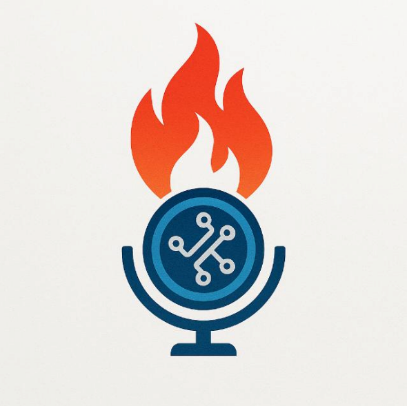

## Didukung Oleh :
>- Dosen Pengampu : Akhmad Hendriawan ST., MT. (NIP.197501272002121003)
>- Mata kuliah : Mikrokontroller
>- Program Studi : D4 Teknik Elektronika
>- Politeknik Elektronika Negeri Surabaya 

## Team Member :

  

|      NRP      |       Nama      |    Jobdesk    |   Akun |
| :-----------:|:----------------:| :------------:| :-----:|
| 2122600031    | Annisa Nurfika Rani  | UI/UX       | [Annisaranii](https://github.com/Annisaranii)
| 2122600034    | Muhammad Rif'an        |  Project Manager | [mrifancode](https://github.com/mrifancode)
| 2122600035    | Admaeny Kusumas       |    UI/UX      | [admaeny](https://github.com/admaeny)
| 2122600044    | Kurniawan Putra Sugiharto  | Hardware | [Kurniawanputraa](https://github.com/Kurniawanputraa)
| 2122600058    | Muchammad Miftahus Shouni  | Program     | [Shoniiii](https://github.com/Shoniiii)

## Smart-Gas-Smoke-Detection-System-For-Fire-Prevention
Proyek ini merupakan sistem deteksi dini kebakaran berbasis mikrokontroler ATmega2560 (Arduino Mega) yang mampu mengenali keberadaan gas LPG dan asap di lingkungan sekitarnya. Sistem ini dirancang untuk memberikan peringatan secara otomatis melalui alarm buzzer dan indikator LED, serta menyediakan antarmuka GUI berbasis Python untuk pemantauan jarak dekat melalui komunikasi UART (serial).

Sensor gas dan asap seperti MQ-2 digunakan untuk mendeteksi senyawa mudah terbakar seperti LPG, asap hasil pembakaran, serta uap alkohol. Ketika konsentrasi gas atau asap melebihi ambang batas tertentu, sistem akan mengaktifkan alarm buzzer yang dikendalikan oleh sinyal PWM, sehingga mampu menghasilkan bunyi dengan intensitas berbeda tergantung level bahaya.

Selain alarm suara dan LED, sistem ini juga mengirimkan informasi status ke GUI yang menampilkan kondisi real-time, seperti konsentrasi gas, status sistem (aman atau bahaya), dan log waktu kejadian. Melalui GUI, pengguna juga dapat melakukan reset alarm, mengatur ambang batas, atau mengaktifkan simulasi kondisi bahaya untuk pengujian sistem.

## Komponen Yang Digunakan
1. **Hardware** 
    a. Arduino ATmega 2560 
    b. Shield PCB 
    c. RTC 
    d. Sensor Gas MQ2 
    e. Sensor Asap MQ135 
    f. Camera  
    g. Buzzer  
    h. Indikator Lampu (led)  

2. **Software** 
    a. KiCad 
    b. Inventor 
    c. Visual Studio Code (VSC) 
    d. Figma  

3. **Alat** 
    a. Solder 
    b. Timah solder 
    c. Kabel jumper 
    d. Breadboard 
    e. Obeng 
    f. PCB  
    g. Filamen  
